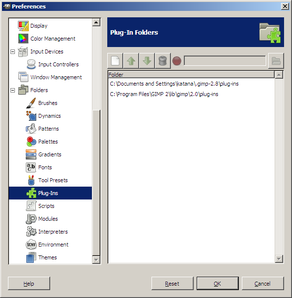

# IP creator (makeip)

**IP creator** (`makeip`) is an utility used for generating homebrew **Sega
Dreamcast** bootstrap files, also known as `IP` which stands for **Initial
Program**. This file is often known as the `IP.BIN` file.

`IP.BIN` file is used for making selfboot (**MIL-CD**) discs for **Sega
Dreamcast** softwares. When inserted in the bootsector of a disc, the bootstrap
program (`IP.BIN`) executes the real Dreamcast program stored on the disc which
is often called `1ST_READ.BIN`.

**IP creator** will generates a custom `IP.BIN` file designed for homebrew
programs. It uses minimal copyrighted code from Sega, i.e. the minimum that
can't be removed.

All `IP.BIN` files contains custom fields used to describe some properties of
the software present on the disc. **IP creator** will allow you to fill these
fields. It also supports the insertion of custom images in the boot screen.
These kind of images are called **MR images** or **MR logos** and are often
stored in files with the `.mr` extension.

Below an example of the *ADK/Napalm* MR image shown in the boot screen
(extracted from `dcload` bootstrap):


## Building

This program is a standard C program which may be compiled with **GNU Make**.

1. Edit the `Makefile` and check if everything is OK for you.
2. After that enter `make`.

## Usage

To use this tool, two modes are available:

1. Using a IP template file (`ip.txt`);
2. Using command-line arguments.

### Using a IP template file

This mode is the historical way to populate the fields of the `IP.BIN` file.

Create a text file called `ip.txt` and write this content on it:

	Device Info   : CD-ROM1/1
	Area Symbols  : JUE
	Peripherals   : E000F10
	Product No    : T0000
	Version       : V1.000
	Release Date  : 20000627
	Boot Filename : 1ST_READ.BIN
	SW Maker Name : YOUR NAME HERE
	Game Title    : TITLE OF THE SOFTWARE

Then run the following command:

	makeip ip.txt IP.BIN

This will generate the `IP.BIN` with the fields above.

You don't have to fill all the fields, removing them from the `ip.txt` will use
the default. So a minimal `ip.txt` file may be like:

	Product No    : T0000
	Version       : V1.000
	SW Maker Name : YOUR NAME HERE
	Game Title    : TITLE OF THE SOFTWARE

**Note:** In the original `ip.txt` files, you may have the fields **Hardware
ID** and **Maker ID** declared. They can't be altered so it isn't necessary
anymore to pass them. Plus, the **Device Info** field may contains a fake
**CRC** like `0000` (see below in the **Device Info** field sub-section for
more info), this isn't necessary but it will still work. 

###  Using command-line arguments

If you want you may pass directly the field information by using the proper
switch.

	-a <areasymbols>    Area sym (J)apan, (U)SA, (E)urope (default is JUE)
	-b <bootfilename>   Boot filename (default is 1ST_READ.BIN)
	-c <companyname>    Company name / SW maker name (default is KallistiOS)
	-d <releasedate>    Release date (format: YYYYMMDD, default is today)
	-e <version>        Product version (default is V1.000)
	-g <gametitle>      Title of the software (default is GAMETITLE)
	-i <deviceinfo>     Device info (format: CD-ROMx/y, default is CD-ROM1/1)
	-n <productno>      Product number (default is T-00000)
	-p <peripherals>    Peripherals (default is E000F10)

### About options

Additional available options are:
	
	-f                  Force overwrite <IP.BIN> output file if exist
	-l <mrfilename>     Insert a MR image into the IP.BIN
	-t <tmplfilename>   Use an external IP.TMPL file (override default, which is
                        LiENUS IP.BIN replacement)
	-v                  Enable verbose mode

To learn more about **MR images**, please read below.

## Information about specific fields

Some fields used in the bootstrap need to be detailed:

### Area Symbols

The **Area Symbols** field consists of 8 characters, which are either space or
a specific letter. Each of these represent a geographical region in which the
disc is designed to work. So far, only the first 3 are assigned, the 5 others
were never been used so they are just left blank.

Supported area are **Japan** (and the rest of East Asia), **USA + Canada**, and
**Europe**.

If the character for a particular region is a space, the disc will not be
playable in that region. If it contains the correct region character, it will
be.

The region characters used are `J`, `U`, and `E`, respectively. So a disc only
playable in Europe would have an Area Symbols string of `"  E     "`. This
operation is made by **IP creator**.

To summarize, if you want your program region-free, you just have to assign
`JUE` to the **Area Symbols** field. This is the case by default.

### Device Information

The **Device Information** field begins with a 4 digit hexadecimal number,
which is a **CRC** on the **Product Number** and **Product Version** fields
(16 bytes). Then comes the string `" CD-ROM"`, and finally an indication of how
many discs this software uses, and which of these discs that this is. This is
indicated by 2 positive numbers separated with a slash. So if this is the second
disc of three, the **Device Information** field might be something like 
`"8B40 CD-ROM2/3  "`.

Please note, commercial `IP.BIN` files (which aren't produced by **IP creator**)
supports the `" GD-ROM"` type. Also, the **CRC** value doesn't need to be
provided as it's computed automatically by the **IP creator** program.

In clear, you just have to pass `CD-ROMx/y` to that field, where `x` is the disc
number and `y` the total discs in the set. The default value is `CD-ROM1/1`.

### Peripherals

The **Peripherals** field is a 28 bit long bitfield represented by a 7 digit
hexadecimal number. The meaning of the individual bits in each digit is given
below:

	<A><-------B------> <C->
	0000 0000 0000 0000 0000 0000 0000
	^^^^ ^^^^ ^^^^ ^^^^ ^^^^    ^    ^
	|||| |||| |||| |||| ||||    |    |
	|||| |||| |||| |||| ||||    |    +----- Uses Windows CE
	|||| |||| |||| |||| ||||    |
	|||| |||| |||| |||| ||||    +-----  VGA box support
	|||| |||| |||| |||| ||||
	|||| |||| |||| |||| |||+----- Other expansions
	|||| |||| |||| |||| ||+----- Puru Puru pack
	|||| |||| |||| |||| |+----- Mike device
	|||| |||| |||| |||| +----- Memory card
	|||| |||| |||| |||+------ Start + A + B + Directions
	|||| |||| |||| ||+------ C button
	|||| |||| |||| |+------ D button
	|||| |||| |||| +------ X button
	|||| |||| |||+------- Y button
	|||| |||| ||+------- Z button
	|||| |||| |+------- Expanded direction buttons
	|||| |||| +------- Analog R trigger
	|||| |||+-------- Analog L trigger
	|||| ||+-------- Analog horizontal controller
	|||| |+-------- Analog vertical controller
	|||| +-------- Expanded analog horizontal
	|||+--------- Expanded analog vertical
	||+--------- Gun
	|+--------- Keyboard
	+--------- Mouse

The group of bits indicated by `B` above indicate the discs minimum controller
requirements. So if the **Z button** bit is set, the software can not be used
with a controller that doesn't have a **Z button**. The `A` group indicates
which optional peripherals the disc supports. The `C` group indicates which
kinds of expansion units that the disc supports. The `VGA box support` bit
indicates that the disc can be run in **VGA** mode. The `WinCE` bit speaks for
itself and shouldn't be used for any homebrew program, so you have to leave this
field to `0`.

### Release Date

The **Release Date** field is in the `YYYYMMDD` format. By default, it's
initialized with today.

### (Product) Version

The **Version** field is the `Vx.yyy` format, where `x` is the major number and
`yyy` the minor number. Default is `V1.000`.

## GIMP MR Image Plug-in

[GIMP](https://www.gimp.org/) is a cross-platform image editor available for
GNU/Linux, macOS and Windows. The provided `gimp/file-mr.py` file is a 
[GIMP](https://www.gimp.org/) plug-in used for encode/decode **MR images**.
  
So by using this plug-in, you can load and save `.mr` files directly in GIMP.
To install the GIMP plug-in:

1. Make the plug-in executable: ```chmod +x file-mr.py``` or equivalent.
2. Place the plug-in in the `plugins` directory. This directory is different
   depending on what operating system you use. To find out go to `GIMP` >
   `Preferences` > `Folders` (*Expand option*) > `Plugins`.
3. That's it!



## About MR images

To be used in the generated `IP.BIN` file, the **MR image** should be:

1. **320 * 90** or less;
2. Less than **128** colors;
3. Less than **8192 Bytes**.

The transparent color is `#c0c0c0`, or `192`, `192`, `192` in RGB.

## Acknowledgments

* [Jacob Alberty](https://github.com/jacobalberty) (LiENUS): Copyright-free
  bootstrap replacement (`IP.TMPL`). It is used by default in the **IP creator**
  program.
* [Marcus Comstedt](http://mc.pp.se/dc/sw.html) (
  [zeldin](https://github.com/zeldin)): Initial release of the 
  [IP creator](http://mc.pp.se/dc/sw.html) tool (`makeip`).
* [Andrew Kieschnick](http://napalm-x.thegypsy.com/andrewk/dc/) (ADK/Napalm):
  Code to insert `.mr` images into `IP.BIN` from
  [logotools](http://napalm-x.thegypsy.com/andrewk/dc/) (`logoinsert.c`).
* [Andress Antonio Barajas](https://twitter.com/bbhoodsta)
  ([BBHoodsta](https://gitlab.com/BBHoodsta)): Tons of fixes and improvements.
  Maker of the **GIMP MR Image Plug-in**.
* [SiZiOUS](http://sizious.com/): Complete refactoring of the project and
  provider of the snippet for decoding `.mr` images (extracted from
  [Selfboot Inducer](https://sizious.com/download/dreamcast/#selfboot-inducer)).

## License

This project is licensed under the **BSD 2-clause "Simplified" License** - see
the [LICENSE](LICENSE.md) file for details.